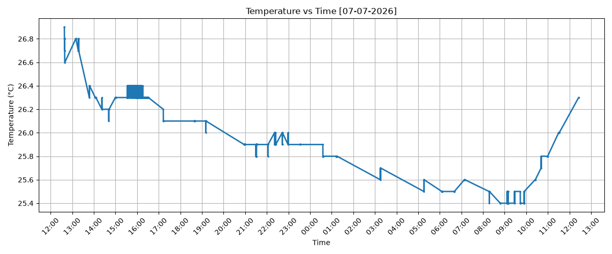
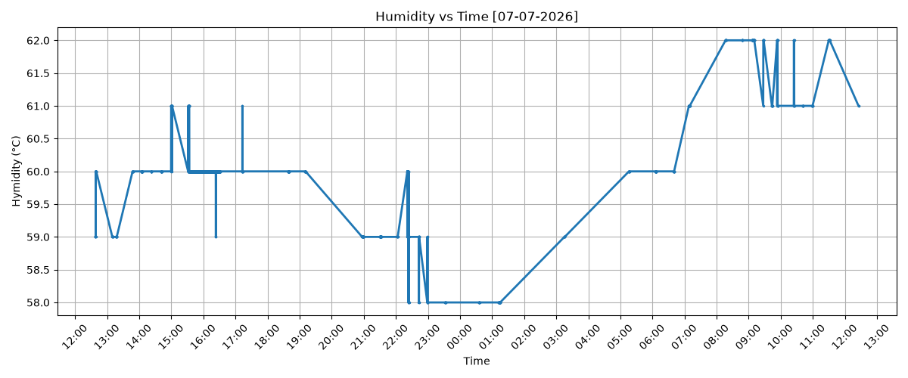
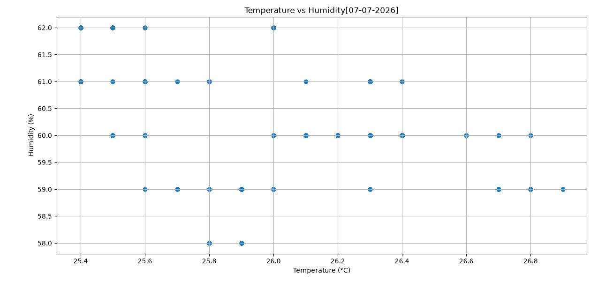

# 🌿 Indoor Climate Companion using Arduino and Python

This project demonstrates continuous indoor climate monitoring using an Arduino Uno and a DHT11 temperature and humidity sensor. Sensor readings are collected, logged into a CSV file, analyzed using Python, and visualized through graphs to provide meaningful insights into indoor environmental conditions. A Streamlit dashboard prototype and a Figma dashboard design were developed to explore different approaches for presenting the collected data.

---

## 🎯 Objectives

The goals of this project were to:

- Interface a DHT11 sensor with an Arduino Uno
- Continuously collect temperature and humidity data
- Log sensor readings into a CSV file
- Analyze environmental trends using Python
- Visualize the collected data through graphs
- Design a user-friendly dashboard for presenting indoor climate information

---

## 📖 Project Overview

### Hardware Setup


### Data Visualizations

| Temperature vs Time | Humidity vs Time |
|---------------------|------------------|
|  |  |

### Temperature vs Humidity



### Dashboard

- Streamlit dashboard prototype
- Figma dashboard design

### 🌐 Live Demo

https://indoorclimatecompanion.streamlit.app/

---

## ✨ Features

- 🌡️ Measures indoor temperature using the DHT11 sensor
- 💧 Monitors indoor humidity in real time
- 💾 Logs environmental data into a CSV file
- 📈 Generates temperature and humidity trend graphs
- 🔄 Visualizes the relationship between temperature and humidity
- 🏡 Presents homeowner-friendly environmental insights
- 🎨 Explores both Streamlit and Figma as dashboard solutions

---

## 🛠 Components Used

### Hardware

- Arduino Uno
- DHT11 Temperature & Humidity Sensor
- Breadboard
- Jumper wires
- USB cable

### Software

- Arduino IDE
- Python 3
- Pandas
- Matplotlib
- Streamlit
- Figma

---

## ⚙️ How It Works

1. The DHT11 sensor measures indoor temperature and humidity.
2. The Arduino reads the sensor values continuously.
3. The sensor readings are transmitted to the computer.
4. Python stores the data in a CSV file.
5. The collected data is analyzed using Pandas.
6. Matplotlib generates graphs showing environmental trends.
7. The results are presented through a dashboard interface.

---

## 📂 Repository Structure

```text
Indoor-Climate-Companion/
│
├── app.py
├── TnH_sensor.ino
├── clean_data.py
├── environment_data.csv
├── Figure_1.png
├── Figure_2.png
├── Figure_3.png
├── hardware_setup.jpg
├── README.md
```

---

## 🚀 Getting Started

### Hardware

- Connect the DHT11 sensor to the Arduino Uno.
- Upload `TnH_sensor.ino` using the Arduino IDE.

### Software

Install the required Python libraries:

```bash
pip install pandas matplotlib streamlit
```

Run the Python analysis:

```bash
python clean_data.py
```

Launch the Streamlit dashboard:

```bash
streamlit run app.py
```

---

## 🔧 Challenges and Debugging

Like most hardware projects, this one involved several rounds of troubleshooting before everything worked reliably.

- Debugged wiring issues to obtain stable sensor readings.
- Corrected CSV handling for reliable data logging.
- Resolved file path errors while integrating the Streamlit dashboard.
- Explored different dashboard layouts before settling on a clean presentation.
- Focused on converting raw sensor readings into meaningful information rather than simply displaying graphs.

Each challenge strengthened my understanding of integrating embedded systems with Python for data analysis and visualization.

---

## 📚 What I Learned

Through building this project, I learned:

- Interfacing digital sensors with Arduino
- Collecting and storing environmental data
- Processing datasets using Pandas
- Creating data visualizations using Matplotlib
- Building a basic dashboard using Streamlit
- Designing user-centered interfaces in Figma
- Developing a complete end-to-end IoT workflow

Most importantly, this project helped me understand how hardware, software, and visualization work together to transform raw sensor readings into useful information for end users.

---

## 🔮 Future Improvements

- Add Wi-Fi connectivity for remote monitoring
- Store sensor data in the cloud
- Send alerts when environmental conditions exceed comfortable ranges
- Support multiple sensors across different rooms
- Display live interactive graphs
- Integrate additional environmental sensors such as air quality or light sensors

---

## 💭 Reflection

This project was my first complete environmental monitoring system that combined electronics, data analysis, and dashboard design into a single workflow. Beyond collecting sensor readings, I focused on presenting the information in a way that is meaningful and easy to understand. It strengthened my understanding of how embedded systems, Python, and thoughtful interface design can work together to build practical IoT solutions.

---

## 👩‍💻 Author

**Aadyaa Mehrotra**
